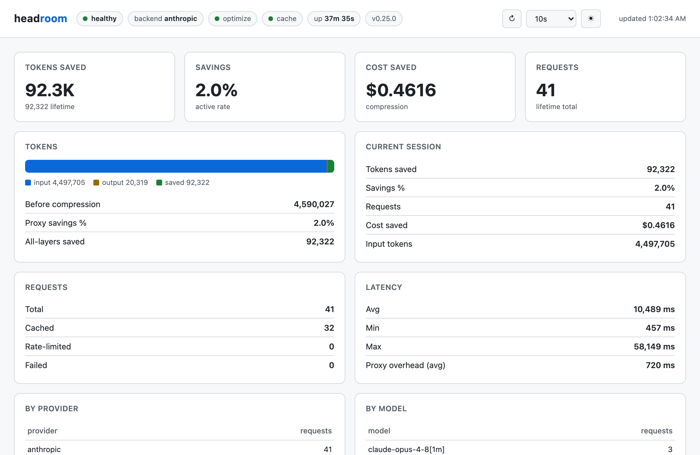

# docker-ai-headroom

[Headroom](https://github.com/chopratejas/headroom) proxy + a small dashboard, run with Docker Compose.

Headroom sits between your AI agent and the upstream LLM, compressing context to cut token usage while preserving answers.



> The dashboard is a vibecoded idea — just a quick visual on top of Headroom's
> `/stats` endpoints, not an official part of the project.

## Run

```bash
docker compose up -d
```

| Service   | URL                     | Purpose                          |
| --------- | ----------------------- | -------------------------------- |
| proxy     | http://localhost:8787   | Anthropic-compatible LLM proxy   |
| dashboard | http://localhost:8080   | Live token-savings dashboard     |

## Use the proxy

Point your client at the proxy by setting `ANTHROPIC_BASE_URL`. The proxy forwards
requests upstream using your existing API key — nothing else to configure.

One-off:

```bash
ANTHROPIC_BASE_URL=http://localhost:8787 claude
```

Persistent (add to `~/.zshrc`):

```bash
export ANTHROPIC_BASE_URL=http://localhost:8787
```

The proxy exposes the standard `POST /v1/messages` endpoint, so any Anthropic SDK
client works the same way — just override the base URL.

## Dashboard

Reads `/health`, `/stats`, and `/stats-history` (proxied through nginx). Features:

- Auto-refresh: 3s / 5s / 10s / Manual
- Light / dark theme

Metrics stay at zero until traffic flows through the proxy.

## Persistence

Token-savings stats are written to `./data/headroom` (mounted to `~/.headroom`
in the container). Delete it to reset the stats.

## License

[MIT](LICENSE) © 2026 Priesdelly
